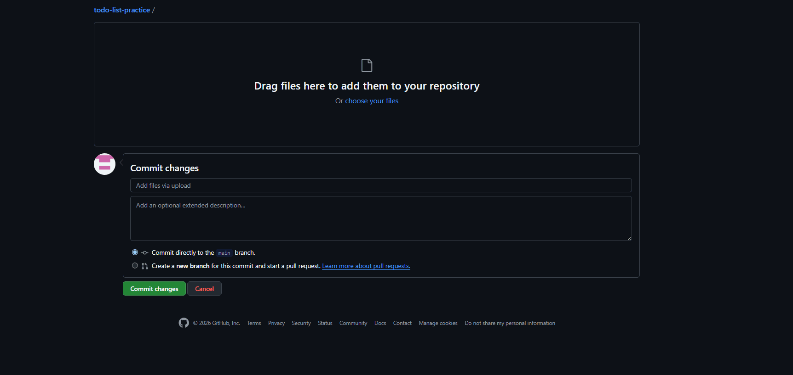

# Todo List — веб-приложение для управления задачами

простой и удобный список задач, который помогает не забывать о важном. проект написан на чистом JavaScript без использования фреймворков. 
поддерживает добавление, удаление и отметку задач выполненными, также данные сохраняются в браузере (LocalStorage), поэтому задачи не пропадают после перезагрузки страницы. 
в интерфейсе есть фиксированный стикер, который реагирует на клик забавным звуком.

## Стек

Frontend: HTML5, CSS3, JavaScript (Vanilla JS)
База данных: не используется (данные хранятся в LocalStorage браузера)
Деплой: Vercel (ссылка ниже)

## Возможности

- добавление новых задач
- отметка задач как выполненных 
- удаление отдельных задач
- массовая очистка выполненных задач
- счётчик общего количества задач
- сохранение данных в LocalStorage
- адаптивная вёрстка (работает на телефонах)
- стикер-персонаж со звуком при клике

## Как запустить локально

1. скачайте репозиторий или склонируйте его:
   https://github.com/owosix/todo-list-practice
2. откройте файл `index.html` в любом современном браузере.
3. готово! приложение работает без установки зависимостей и сборки.

## Деплой

🔗 [Открыть рабочий сайт](https://todo-list-practice-4aop.vercel.app/)

## Демонстрация работы

## Качество кода
